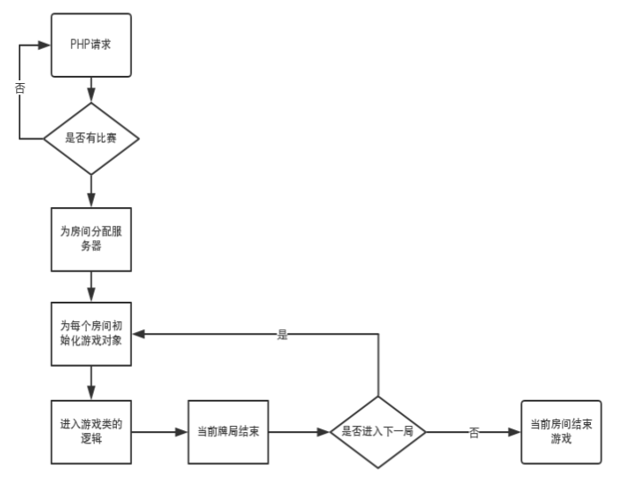

# poker-node 比赛接口介绍

## 比赛触发以及比赛进行流程介绍（nodejs端）:
1. 位于sever/match_dzPoker/cron 下的matchPokerCron 会轮循调用phpPost请求比赛列表；
2. 如果有比赛，class文件夹下的Match_dzPoker文件里的函数会被调用，这里主要完成对php返回的房间数据进行处理，按服务器分配房间的工作
3. rpc调用游戏服务器函数 game_dzPoker.roomRemote.startMatchRoom() 
4. Room.class.js 调用 startMatchRoom() 进行游戏逻辑类的实例化工作
5. 按游戏逻辑类 Game_dzPoker.class.js 进行游戏
6. 调用游戏逻辑类的checkout方法，结束当前局的游戏，checkout方法调用phpPost函数向php请求提交结算数据
7. 按照特定的逻辑调用Room.class.js里的startMatchRoom()函数，此时回到第4步；若此时php返回当前桌不在了，怎结束游戏循环

流程图见下：




## 接口介绍
### php端
```
G.phpPost(request_data, callback_function)
    request_data: 请求参数
    callback_function: 回调函数

    对php发去post请求
```

### 手机客户端
```
connector.entryHandler.longinServer(msg, session, next)
    msg： 登录参数
    session：session
    next： 回调函数

    进行登录验证，并做相应的处理。包括：进行phpPost请求以验证登录； 绑定uid到session； 通知其他人此登录消息


connector.entryHandler.onUserLeave(app, session)
    app: null,
    session: session

    玩家退出游戏时调用。对session和一些全局变量进行销毁处理

match_dzPoker.matchPokerCron.getMatch()
    定时请求php看是否有比赛裂变


this.toClent(data, uidArr, exclude)
    data: 消息json
    uidArr： 推送人uid名单列表

    比赛中房间内消息推送，如果uidArr为空，将推送给房间内所有人
```


